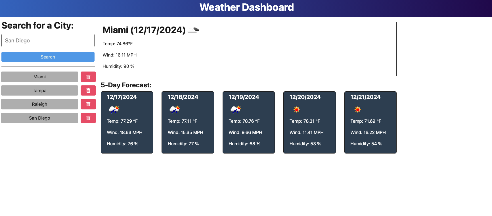

# Full-Stack Weather Dashboard App

## Table of Contents
- [Descriptionn](#description)
- [Installation Instructions](#installation-instructions)
- [How to Use the App](#how-to-use-the-app)
- [Contribution Guidelines](#contribution-guidelines)
- [Test Instrustions](#test-instructions)
- [Questions](#questions)

## Description
- This project is a full-stack weather dashboard app 
- The app uses the openweather.org API to access the current weather and the forecast for a specific location
- The app uses Vite for the client interface and Express for the server

## Installation Instructions
- Run "npm install" in the parent directory
- Update the .env.example file with your openweather.org API key and then re-name it to .env
- Run "npm run start:dev" to build the project and run the clien and server concurrently
- Client is accessible on port 3000 (if running Vite) and server listens on port 3001 (or as automatically mapped if deploying to a hosting service such as Render)

## How to Use the App
- The app displays the current weather and the 5 day forecast for the city being searched
- Currently the app doesn't allow to enter the State and Country information into the search form. The city displayed is ted is the first city returned by a query to the openweather API from a list of possible matchin cities (quer length parameter = 1)
- Previous searches are stored in a json database and are displayed for the user
- Previous searches can be removed from the database via a DELETE fetch call to the API
- The app uses a POST method to send the search request to the server for a city (city name is in the body of the request)

## Contribution Guidelines
- The app was built on started code provided by the UNC coding bootcamp. Please cite the UNC coding bootcamp when re-using code and obtain permission from UNC coding bootcamp
- Jan Krajniak is the secondary author of this application

## Test Instructions
- N/A

## Questions
- My GitHub username: jankrajniak
- My email address: jan.krajniak@gmail.com
- Additional instructions on how to contact me:
  - If you wish to contact me, please reach out to me at the above email.

## License
- This project is licensed under the MIT license: 

## Project submission requirements

Link to repository: https://github.com/jankrajniak/weatherDashboard

Link to deployed application: https://weatherdashboard-d4ja.onrender.com/

Screenshot:
